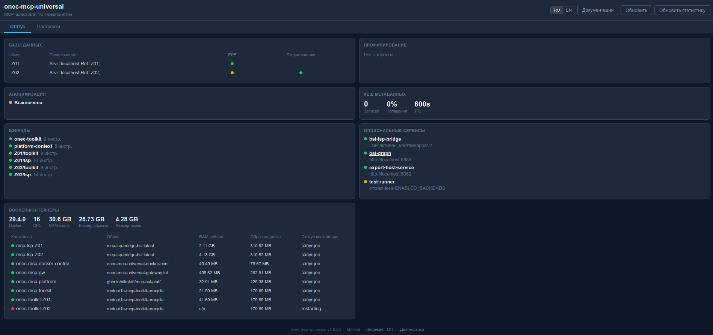
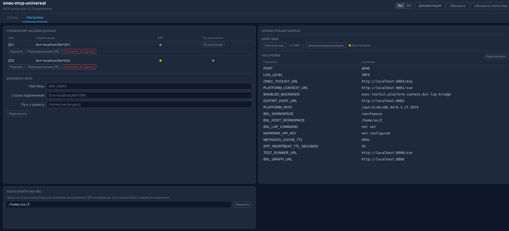
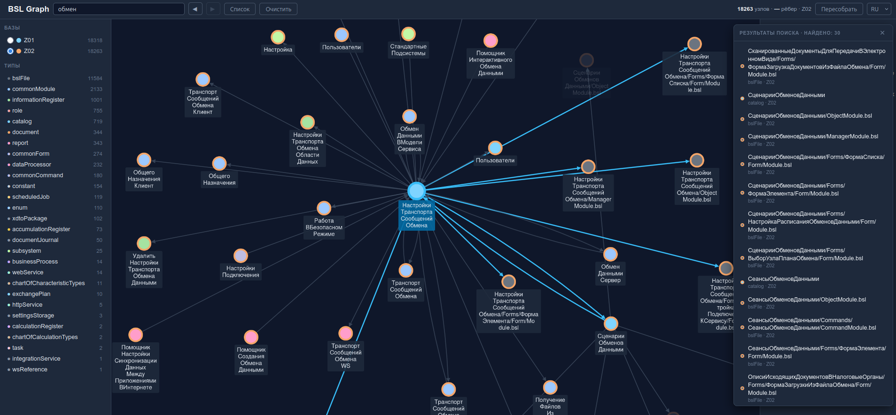
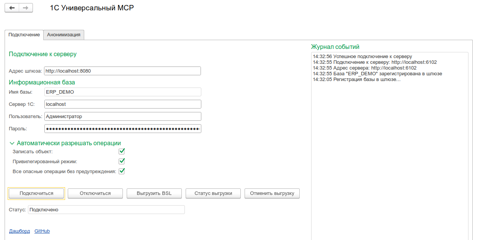

# onec-mcp-universal

Единый MCP-сервер для работы с 1С:Предприятие из AI-ассистентов и любых MCP-клиентов

Один адрес `http://localhost:8080/mcp` вместо нескольких отдельных MCP-подключений. Шлюз принимает запросы от AI и маршрутизирует их к нужному бэкенду. Каждый сеанс AI-ассистента работает со своей активной базой данных независимо (per-session routing).







---

## Содержание

- [Возможности](#возможности)
- [Дизайн Workflow Layer](#дизайн-workflow-layer)
- [Context Guard и Session Continuity](#context-guard-и-session-continuity)
- [Архитектура](#архитектура)
- [Требования](#требования)
- [Quick Start](#quick-start)
- [Установка на Linux](#установка-на-linux)
- [Установка на Windows](#установка-на-windows)
- [Подключение к AI-ассистенту](#подключение-к-ai-ассистенту)
- [Подключение базы 1С](#подключение-базы-1с)
- [Обработка MCPToolkit.epf](#обработка-mcptoolkitepf)
- [Работа с несколькими базами](#работа-с-несколькими-базами)
- [Удалённое подключение](#удалённое-подключение)
- [Примеры команд AI](#примеры-команд-ai)
- [Web UI дашборд](#web-ui-дашборд)
- [Настройка 1С:Напарник](#настройка-1снапарник-поиск-по-итс)
- [Опциональные модули](#опциональные-модули)
- [Скилы 1С для Codex](#скилы-1с-для-codex)
- [Диагностика](#диагностика)
- [Обновление](#обновление)
- [GitHub Packages](#github-packages)
- [Используемые проекты](#используемые-проекты)
- [Удаление](#удаление)
- [Лицензия](#лицензия)

---

## Возможности

**40+ MCP-инструментов + 1 ресурс:**

| Категория | Кол-во | Описание |
|---|---|---|
| **Данные 1С** | 8 | Запросы к БД, выполнение кода, метаданные, журнал регистрации, права, ссылки |
| **Документация платформы** | 5 | Поиск по API встроенного языка 1С, методы типов, конструкторы |
| **Навигация по BSL** | 14 | Символы, определения, граф вызовов, диагностика, переименование |
| **Поиск по BSL** | 2 | `bsl_index` + `bsl_search_tool` -- полнотекстовый поиск по процедурам/функциям |
| **Запись BSL** | 1 | `write_bsl` -- запись BSL-модулей в проект с автопереиндексацией |
| **ИТС / 1С:Напарник** | 0-1 | `its_search` -- поиск по документации ИТС через API 1С:Напарника (появляется при `NAPARNIK_API_KEY`) |
| **Анонимизация** | 2 | `enable_anonymization` / `disable_anonymization` -- маскировка ПД (152-ФЗ) |
| **Кеширование** | 1 | `invalidate_metadata_cache` -- управление кешем метаданных (TTL 10 мин) |
| **Профилирование** | 1 | `query_stats` -- статистика производительности запросов |
| **Управление и граф** | 12 | Статус сервера, подключение баз, валидация запросов, переиндексация, граф зависимостей |

**MCP-ресурс:** `syntax_1c.txt` -- справочник синтаксиса BSL для контекста AI.

**Ключевые особенности:**

- **Per-session routing** -- каждый сеанс MCP-клиента работает со своей активной БД независимо
- **Автоподключение из EPF** -- нажмите "Подключиться" в обработке, база зарегистрируется автоматически
- **Удалённое подключение** -- шлюз на сервере 1С, AI-ассистент на рабочей станции разработчика
- **Анонимизация ПД** -- маскировка ФИО, ИНН, СНИЛС, телефонов, email со стабильным hash-маппингом
- **1С:Напарник** -- поиск по ИТС через API code.1c.ai
- **BSL полнотекстовый поиск** -- индекс по процедурам/функциям конфигурации
- **Профилирование запросов** -- автоматический замер времени + подсказки по оптимизации
- **Кеширование метаданных** -- TTL-кеш для get_metadata (10 мин по умолчанию)
- **Web UI дашборд** -- визуальная панель на `http://localhost:8080/dashboard` с документацией, двуязычная (RU/EN)
- **Интерактивный веб-просмотрщик графа** -- на `http://localhost:8888/` (профиль `bsl-graph`): cytoscape.js-канвас, drill-down двойным кликом, поиск по нескольким словам (`размеры пособий` → `РазмерыГосударственныхПособий`), история поиска, панель со списком результатов, выбор активной БД радиокнопками. Та же slate-палитра что у дашборда
- **Редактирование .env** -- прямо из дашборда с автоперезапуском шлюза
- **96 скилов для Codex и совместимых локальных skill-runner'ов** -- создание объектов, форм, обработок, отчётов, расширений + workflow-оркестрация
- **Stateful MCP-сессии** -- idle timeout 8 часов
- **Параллельная выгрузка BSL** -- несколько баз выгружаются одновременно, каждая в свою папку `{BSL_WORKSPACE}/{slug}/`, отмена и индексация независимы
- **Атомарная выгрузка через staging-каталог** -- 1cv8 пишет во временную скрытую папку, по завершении атомарно переименовывается в целевую, предыдущая рабочая копия не затирается при сбое
- **Deferred LSP start** -- LSP-контейнер поднимается только после первой успешной выгрузки BSL, без пустых подпапок в workspace до экспорта
- **Безопасная политика экспорта** -- если host export service недоступен, шлюз делает hard-fail; контейнерный `1cv8` включается только при `ALLOW_CONTAINER_DESIGNER_EXPORT=true`
- **Адаптивный таймаут** -- 1 час для localhost, 3 часа для удалённых серверов
- **Автоподбор версии 1cv8** -- при несовпадении версии клиента и сервера хостовый сервис автоматически повторяет выгрузку с нужной версией платформы
- **Авто-обновление статуса EPF на дашборде** -- индикатор подключения обработки обновляется раз в 5 секунд без перезагрузки страницы
- **MCP-совместимые ошибки** -- tool errors с `isError: true` по спецификации MCP
- **Потокобезопасные бэкенды** -- asyncio.Lock для защиты состояния соединений
- **Защита от path traversal** -- валидация путей в API файлового браузера
- **Защита mutating HTTP API токеном** -- `GATEWAY_API_TOKEN` для `/api/action/*`, `/api/register`, `/api/unregister`, `/api/export-*`
- **Потокобезопасный реестр БД** -- threading.Lock для защиты состояния регистрации
- **Кросс-платформенный Docker** -- host network на Linux, bridge на Windows/macOS
- **README / CODEX.md** -- нейтральная документация по эксплуатации + отдельный runbook для Codex
- **docker-control sidecar** -- gateway больше не получает `docker.sock`, все lifecycle-операции идут через внутренний HTTP-контур
- **Защищённый `docker-control`** -- sidecar принимает `/api/*` только с `Authorization: Bearer ...`, общий секрет хранится в `DOCKER_CONTROL_TOKEN`
- **Loopback/internal-only `docker-control`** -- на Linux sidecar опубликован только на `127.0.0.1:8091`, а на Windows/macOS host port `8091` не публикуется вовсе
- **Persistent anonymizer salt** -- стабильное маскирование ПД теперь привязано к отдельному секрету `ANONYMIZER_SALT`, который генерируется `setup.sh` и маскируется в дашборде
- **Dangerous toolkit path works with EPF approvals out of the box** -- toolkit по умолчанию пропускает dangerous write/exec команды до `MCPToolkit.epf`, а фактическое разрешение задаётся галочками и диалогом подтверждения в самой обработке
- **Rate limiting для REST/дашборда** -- `GATEWAY_RATE_LIMIT_*` защищают `/api/*` и `/dashboard*`, не затрагивая `/mcp` и `/health`
- **Работает БЕЗ установки 1С** -- platform-context опциональный (Docker profile), gateway стартует с одним onec-toolkit
- **Windows: автозапуск экспорт-сервиса** -- Scheduled Task, переживает перезагрузку
- **Empty placeholder volumes** -- `data/empty-*` папки убирают ошибки Docker при отсутствии Linux-путей
- **1100+ автоматических тестов**, CI/CD через GitHub Actions
- **Coverage gate в CI:** `line+branch >= 94%`

### Локальный запуск тестов

```bash
python3 -m venv .venv
.venv/bin/pip install -r gateway/requirements-dev.txt
cd gateway
../.venv/bin/bash ./scripts/test.sh
```

На Linux с PEP 668 используйте локальное виртуальное окружение. `./scripts/test.sh` выполняет preflight-проверку `pytest-asyncio` и даёт явную ошибку, если dev-зависимости не установлены.

---

## Дизайн Workflow Layer

План интеграции UX/workflow-слоя поверх текущей технической базы описан в документе:

- [`docs/workflow-layer-design.md`](docs/workflow-layer-design.md)

Документ покрывает:
- Expert-skill aliases (`epf-expert`, `erf-expert`, `mxl-expert`, `inspect`, `validate`)
- Project bootstrap (`1c-project-init`, `templates/mcp.json`)
- Context guard (`PostToolUse` hook + мониторинг 70%/85%)
- Session continuity (`session-save/restore/retro`)
- Native-дизайн `1c-feature-dev` под стек `onec-mcp-universal`
- Process orchestration layer: `brainstorm`, `write-plan`, `openspec-proposal`, `openspec-apply`, `openspec-archive`
- Совместимость с распространёнными входными точками: `1c-help-mcp`, `bsp-patterns`, `img-grid`, `role-expert`, `subsystem-expert`, `subagent-dev`, `1c-test-runner`, `1c-web-session`, `playwright-test`
- Пример сквозного жизненного цикла фичи: [`docs/feature-lifecycle-example.md`](docs/feature-lifecycle-example.md)

---

## Context Guard и Session Continuity

### Что добавлено

- Скрипты мониторинга контекста: `tools/context-monitor.sh`, `tools/context-monitor.ps1`
- Пороги предупреждений: `70%` и `85%` использования контекста
- Session-скилы: `/session-save`, `/session-restore`, `/session-retro`

### Как подключить context-monitor (Linux/macOS)

Пример для `PostToolUse` hook в конфиге AI-ассистента:

```bash
bash ./tools/context-monitor.sh
```

Опциональные переменные:

- `MAX_TOKENS` (по умолчанию `200000`)
- `WARN_PERCENT` (по умолчанию `70`)
- `CRITICAL_PERCENT` (по умолчанию `85`)

### Как подключить context-monitor (Windows PowerShell)

```powershell
powershell -ExecutionPolicy Bypass -File .\tools\context-monitor.ps1
```

Параметры:

- `-MaxTokens` (по умолчанию `200000`)
- `-WarnPercent` (по умолчанию `70`)
- `-CriticalPercent` (по умолчанию `85`)

### Шаблон project bootstrap

- Используйте `/1c-project-init` для локальной инициализации проекта.
- Шаблон MCP-конфига находится в `templates/mcp.json` и копируется в `.mcp.json` проекта без перезаписи существующего файла.

---

## Архитектура

```
MCP clients / Codex
       | HTTP :8080/mcp (Streamable HTTP)
       | (Mcp-Session-Id -> per-session routing)
       v
+----------------------------------------------+
|  onec-mcp-gw  (Python, host network)         |
|  non-root runtime, no direct docker.sock     |
|  internal Docker API -> docker-control       |
|                                              |
|  Статические бэкенды:                        |
|  +- onec-toolkit      :6003  (HTTP)          |
|  +- platform-context  :8081  (SSE)           |
|                                              |
|  Динамические бэкенды (per-DB):              |
|  +- onec-toolkit-{db} :6100+ (HTTP)          |
|  +- mcp-lsp-{db}      (stdio)                |
|                                              |
|  Модули шлюза:                               |
|  +- anonymizer      -- маскировка ПД         |
|  +- metadata_cache  -- кеш метаданных        |
|  +- profiler        -- замер запросов        |
|  +- bsl_search      -- индекс BSL            |
|  +- naparnik_client -- API 1С:Напарника      |
|  +- web_ui          -- /dashboard            |
|                                              |
|  Per-session routing (idle 8h)               |
|  /data/db_state.json <- persistence          |
+----------------------------------------------+
                 |
                 v
        +---------------------------+
        | onec-mcp-docker-control   |
        | only service with         |
        | /var/run/docker.sock      |
        +---------------------------+
       ^           ^                ^
       |           |                |
  MCPToolkit.epf   |     https://code.1c.ai
  (клиент 1С)      |     (1С:Напарник API)
                   |
           /dashboard
           (Web UI)
```

**Per-session routing:** каждый AI-клиент получает уникальный `Mcp-Session-Id`. Шлюз маршрутизирует запросы к активной базе данных этой сессии. Разные сеансы Codex и других MCP-клиентов могут одновременно работать с разными базами. Idle timeout сессий -- 8 часов.

| Контейнер | Образ | Роль |
|---|---|---|
| `onec-mcp-gw` | Собирается локально | MCP-шлюз, маршрутизация, per-session routing |
| `onec-mcp-docker-control` | Собирается локально | Внутренний sidecar для lifecycle Docker-контейнеров, диагностики и LSP proxy |
| `onec-mcp-toolkit` | [roctup/1c-mcp-toolkit-proxy](https://github.com/ROCTUP/1c-mcp-toolkit) | Статический бэкенд данных |
| `onec-mcp-platform` | [ghcr.io/alkoleft/mcp-bsl-platform-context](https://github.com/alkoleft/mcp-bsl-platform-context) | Документация платформы |
| `onec-toolkit-{db}` | roctup/1c-mcp-toolkit-proxy | Динамический бэкенд данных (per-DB) |
| `mcp-lsp-{db}` | mcp-lsp-bridge-bsl | BSL Language Server (per-DB) |

---

## Требования

- **Docker** 24+ и Docker Compose v2 — [установить](https://docs.docker.com/get-docker/)
- **Codex CLI** (`codex`) — для автоматической регистрации MCP и локальной установки skills
- **Linux** (Ubuntu 22.04+) или **Windows** 10/11 с Docker Desktop (WSL2)
- **Платформа 1С:Предприятие** 8.3, установленная на хосте
- **Информационная база 1С** (серверная или файловая)

---

## Quick Start

### Linux

```bash
git clone https://github.com/AlekseiSeleznev/onec-mcp-universal.git
cd onec-mcp-universal
./setup.sh
# или сразу с графом зависимостей:
./setup.sh --with-bsl-graph
```

### Windows

**Требуется** [Git for Windows](https://gitforwindows.org/) (включает Git Bash) или WSL2.

```bash
git clone https://github.com/AlekseiSeleznev/onec-mcp-universal.git
cd onec-mcp-universal
./setup.sh
# или сразу с графом зависимостей:
./setup.sh --with-bsl-graph
```

### Что делает `setup.sh`

1. Проверяет зависимости: Docker, Docker Compose v2, работающий daemon, наличие `codex` CLI
2. Определяет ОС — на Windows/macOS автоматически создаёт `docker-compose.override.yml` из `docker-compose.windows.yml` (bridge-сеть; gateway ходит в `docker-control` по service name)
3. Создаёт `.env` из `.env.example` (порт 8080, **авто-определение пути к платформе 1С** на Linux, абсолютный `BSL_WORKSPACE` и `BSL_HOST_WORKSPACE` внутри проекта, автоматически сгенерированные `DOCKER_CONTROL_TOKEN` и `ANONYMIZER_SALT`)
4. Предупреждает, если порт 8080 занят другим процессом
5. Если включён `bsl-lsp-bridge`, автоматически собирает локальный образ `mcp-lsp-bridge-bsl:latest` с Java 21-совместимым BSL Language Server
6. Собирает и запускает core-контур; при `--with-bsl-graph` также поднимает встроенный локальный профиль `bsl-graph`
7. Ждёт healthcheck gateway и `docker-control` (до 120 секунд — бэкенды стартуют дольше)
8. Регистрирует MCP-сервер через `codex mcp add` — основной Codex-first сценарий

Повторный запуск `setup.sh` безопасен — он идемпотентен (`.env` не перезаписывается, MCP-запись пересоздаётся).

После установки проверьте `codex mcp list` или подключите URL `http://localhost:8080/mcp` в любом другом MCP-клиенте.

**Dashboard:** [http://localhost:8080/dashboard](http://localhost:8080/dashboard)

**Опциональный graph backend:** `./setup.sh --with-bsl-graph` или `docker compose --profile bsl-graph up -d --build`

---

## Установка на Linux

### 1. Предварительные требования

Убедитесь, что установлены Docker и Docker Compose:

```bash
docker --version    # Docker 24+
docker compose version  # Docker Compose v2
```

Если Docker не установлен, следуйте [официальной инструкции](https://docs.docker.com/engine/install/ubuntu/).

### 2. Скачать проект

```bash
git clone https://github.com/AlekseiSeleznev/onec-mcp-universal.git
cd onec-mcp-universal
./setup.sh
# если нужен dependency graph:
./setup.sh --with-bsl-graph
```

Если нужен только ручной запуск без `setup.sh`, сначала соберите локальный LSP-образ:

```bash
./tools/build-lsp-image.sh
docker compose up -d --build
```

### 3. Настроить `.env` при необходимости

`setup.sh` уже создаёт `.env` автоматически. При ручном запуске создайте его сами:

```bash
cp .env.example .env
```

Откройте `.env` и при необходимости укажите путь к платформе 1С:

```env
PLATFORM_PATH=/opt/1cv8/x86_64/8.3.27.2074
```

> Узнать доступные версии: `ls /opt/1cv8/x86_64/`

**Требования к пакетам 1С для выгрузки BSL.** Шлюз запускает `1cv8 DESIGNER` для выгрузки исходников. Нужны пакеты `common` и `client` (или `server`) нужной версии. На DEB-системах:

```bash
sudo dpkg -i 1c-enterprise-8.3.XX.YYYY-common_*.deb
sudo dpkg -i 1c-enterprise-8.3.XX.YYYY-client_*.deb
```

Если установлена только одна версия платформы, а сервер 1С работает на другой — шлюз автоматически обнаружит несоответствие версий и повторит выгрузку с правильным клиентом. Для этого установите клиент нужной версии аналогичным способом.

Опционально -- указать API-ключ 1С:Напарника (для поиска по ИТС):

```env
NAPARNIK_API_KEY=ваш-ключ-api
```

### 4. Запустить контейнеры

```bash
docker compose up -d
```

Первый запуск: 2-3 минуты (скачивание образов + сборка шлюза). Платформа 1С монтируется из `HOST_PLATFORM_PATH` (по умолчанию `/opt/1cv8`) — шлюз автоматически находит нужную версию `1cv8` для выгрузки BSL.

### 5. Проверить

```bash
curl http://127.0.0.1:8080/health
```

Ожидаемый ответ:

```json
{
  "status": "ok",
  "backends": {
    "onec-toolkit": {"ok": true, "tools": 9},
    "platform-context": {"ok": true, "tools": 5}
  }
}
```

После регистрации баз через `MCPToolkit.epf` или дашборд `/health` дополнительно показывает per-DB backend'ы, например `Z01/toolkit`, `Z01/lsp`, `Z02/toolkit`, `Z02/lsp`.

Также можно открыть дашборд в браузере: `http://localhost:8080/dashboard`

---

## Установка на Windows

На Windows Docker Desktop запускает контейнеры через WSL2. Для доступа из контейнера к host-side export service используется `host.docker.internal`, а внутренний sidecar `docker-control` остаётся только в bridge-сети `docker compose`. Для Windows предоставлен отдельный override-файл `docker-compose.windows.yml`.

> **Выгрузка BSL на Windows.** Контейнер шлюза работает в Linux (WSL2) и не может запустить `1cv8.exe` напрямую. Для выгрузки BSL нужен отдельный сервис на хосте — см. шаг 3 ниже.

### Предварительные требования

- **Docker Desktop** 4.25+ с включённым WSL2
- **Python 3.10+** (установленный на хосте Windows) — только для выгрузки BSL
- **Платформа 1С:Предприятие** 8.3 (установленная на хосте Windows)

### 1. Скачать проект

```cmd
git clone https://github.com/AlekseiSeleznev/onec-mcp-universal.git
cd onec-mcp-universal
```

### 2. Запустить установку

```bash
./setup.sh
```

`setup.sh` на Windows создаёт `docker-compose.override.yml`, собирает локальный LSP-образ и запускает core-контур через Docker Desktop.

### 3. Запустить сервис выгрузки на хосте (нужен только для BSL)

```cmd
python tools\export-host-service.py --port 8082
```

Сервис запускает 1cv8 DESIGNER в фоне и сразу отвечает на запрос — соединение не зависает на время выгрузки. Оставить окно открытым или настроить как Windows-службу (через `nssm` или Task Scheduler).

### 4. Настроить `.env` при необходимости

Параметры для Windows (выгрузка BSL через хостовый сервис):

```env
EXPORT_HOST_URL=http://host.docker.internal:8082
```

> На Windows закомментируйте `HOST_PLATFORM_PATH` и `PLATFORM_PATH` — платформа установлена на хосте Windows, а не в WSL.

### 5. Ручной запуск контейнеров с Windows-override

```bash
./tools/build-lsp-image.sh
docker compose -f docker-compose.yml -f docker-compose.windows.yml up -d
```

Этот шаг нужен только если вы не используете `./setup.sh` или сознательно перезапускаете стек вручную. Файл `docker-compose.windows.yml` заменяет `network_mode: host` на bridge-сеть с service-name routing для `docker-control`; host port `8091` не публикуется. Первый запуск: 2-3 минуты.

### 6. Проверить

```bash
curl http://127.0.0.1:8080/health
```

Или откройте в браузере: `http://localhost:8080/dashboard`

### 7. Подключить AI-ассистент

Адрес тот же: `http://localhost:8080/mcp`

### Типичные проблемы на Windows

| Проблема | Решение |
|---|---|
| `platform-context` не стартует | Закомментируйте строку `${HOST_PLATFORM_PATH:-/opt/1cv8}:/opt/1cv8:ro` в `docker-compose.yml` -- на Windows монтирование Linux-путей невозможно |
| Выгрузка BSL не работает | Убедитесь, что запущен `export-host-service.py` и в `.env` указан `EXPORT_HOST_URL=http://host.docker.internal:8082` |
| Порт 8080 занят | Измените порт в `.env`: `GW_PORT=8090` и используйте `http://localhost:8090/mcp` |

---

## Подключение к AI-ассистенту

`setup.sh` регистрирует сервер в Codex автоматически. Для других клиентов — команды ниже.

### Как AI-клиент «знает», когда использовать инструменты

После любого подключения сервер на `initialize` возвращает блок **`instructions`** — краткий протокол работы с 1С (какие инструменты вызывать в каком порядке, когда сообщать о недоступности вместо выдумывания кода). Современные MCP-клиенты с поддержкой `instructions` подмешивают этот блок в системный промпт ассистента автоматически. Общий текст протокола продублирован в [`AGENTS.md`](AGENTS.md). Готовые сценарии публикуются через MCP `prompts/list` (`connect_and_inspect`, `describe_object`, `safe_query`, `find_usage`, `bsp_api`, `reindex_after_export`).

### Codex

```bash
codex mcp add onec-universal --url http://localhost:8080/mcp
```

Скилы 1С доустанавливаются в `~/.codex/skills/` скриптом `install-skills.sh` (уже вызван `setup.sh`).

### Cursor / Windsurf / другие Streamable HTTP MCP-клиенты

Любой клиент с поддержкой Streamable HTTP:

```
http://localhost:8080/mcp
```

Guidance-блок (`instructions`) придёт в ответе `initialize` — никаких дополнительных настроек.

---

## Подключение базы 1С

Базу можно подключить тремя способами.

### Способ 1. Из обработки MCPToolkit.epf (рекомендуемый)

1. Откройте `1c/MCPToolkit/build/MCPToolkit.epf` в клиенте 1С:Предприятие
2. Нажмите **Подключиться** -- база зарегистрируется в шлюзе автоматически (Docker-контейнеры создадутся)
3. Нажмите **Выгрузить BSL** -- выгрузка запустится в фоне, обработка не зависнет
4. Нажмите **Статус выгрузки** чтобы проверить завершение выгрузки и дождаться окончания индексации. Пока индекс ещё строится, обработка пишет `Идёт индексация BSL для поиска по коду...`; число символов показывается только после реального завершения индексации

Обработку держать открытой во время работы. Имя базы и сервер определяются автоматически.

### Способ 2. Из Web UI дашборда

Откройте `http://localhost:8080/dashboard`, вкладка **Настройки** -> **Добавить базу**. Заполните имя, строку подключения и путь к проекту.

### Способ 3. Через AI-ассистент

```
Подключи базу ERP_Test, строка подключения Srvr=server-erp;Ref=ERP_Test;, папка /home/user/projects/ERP_Test
```

Шлюз создаст два Docker-контейнера: `onec-toolkit-ERP_Test` (данные) и `mcp-lsp-ERP_Test` (навигация по коду).

**Форматы строки подключения:**

| Тип базы | Формат |
|---|---|
| Серверная | `Srvr=server-erp;Ref=ERP_Test;` |
| С авторизацией | `Srvr=server-erp;Ref=ERP_Test;Usr=Ivanov;Pwd=пароль;` |
| Файловая | `File=/путь/к/базе` |

> **Кириллические и пробельные имена баз** поддерживаются. Шлюз автоматически создаёт безопасный slug для Docker-контейнеров (`Бухгалтерия_тестирование` → `Buhgalteriy_testirovanie`), сохраняя оригинальное имя для отображения.

### Выгрузка исходников BSL

После подключения базы выгрузите исходники для навигации по коду через кнопку **Выгрузить BSL** в обработке или командой AI:

```
Выгрузи исходники конфигурации
```

Выгрузка использует `1cv8 DESIGNER /DumpConfigToFiles` (headless, через `xvfb-run`). Шлюз автоматически:
- **Пишет через staging-каталог** -- 1cv8 выгружает в скрытую временную папку `{BSL_WORKSPACE}/.{slug}.staging-<hash>` рядом с целевой; по завершении она атомарно переименовывается в `{BSL_WORKSPACE}/{slug}`. Прерванная выгрузка не затирает предыдущую рабочую копию и не ломает индекс/LSP. Префикс `.` скрывает staging от `ls` без `-a` и от индексеров, игнорирующих dotfiles
- **Находит нужный бинарник** -- сканирует `/opt/1cv8/x86_64/` для всех установленных версий с толстым клиентом (`1cv8`)
- **Определяет версию сервера** -- при несовпадении версий клиента и сервера извлекает нужную версию из ошибки и повторяет попытку с подходящим бинарником
- **Выгружает в фоне** -- обработка сразу отвечает и не зависает
- **Автоматически индексирует BSL** -- после выгрузки запускает полнотекстовое индексирование процедур/функций для `bsl_search_tool`
- **Не публикует промежуточный размер индекса** -- пока индексация большой выгрузки ещё не стабилизировалась, статус остаётся `Идёт индексация BSL для поиска по коду...`; число символов появляется только после финального прохода
- **Адаптивный таймаут** -- 1 час для localhost, 3 часа для удалённых серверов 1С

> **Почему staging?** Во время длительной выгрузки (десятки тысяч файлов) прямая запись в рабочую папку базы приводила бы к «полубитой» версии: индексер и LSP сканируют каталог и увидели бы смесь старых и новых файлов. Staging + атомарный `rename` гарантирует, что переход от предыдущей рабочей копии к новой происходит одним шагом файловой системы.

По умолчанию используется host-side export service (`EXPORT_HOST_URL`). Если он недоступен, экспорт завершается с ошибкой (hard fail) для защиты software-лицензии 1С. Контейнерный экспорт разрешается только явным флагом:

```env
ALLOW_CONTAINER_DESIGNER_EXPORT=true
```

Проверить готовность кнопкой **Статус выгрузки** или:

```
Покажи статус выгрузки BSL
```

Время выгрузки зависит от размера конфигурации: БП/УТ -- 5-15 мин, ERP/ЗУП -- 30-60 мин.

> **Требование:** на машине шлюза должна быть установлена полная платформа 1С (пакет `1c-enterprise-*-client`, не только серверные компоненты). Версия платформы должна совпадать с версией на сервере 1С. Узнать установленные версии: `ls /opt/1cv8/x86_64/`

### Настройка папки выгрузки BSL

По умолчанию исходники сохраняются в `./bsl-projects` (рядом с `docker-compose.yml`).

#### Linux

**Через дашборд (рекомендуется).** Откройте `http://localhost:8080/dashboard` → вкладка **Настройки** → карточка **ПАПКА ВЫГРУЗКИ BSL** → **Изменить** → введите путь под `/home/...` или выберите через браузер папок → **Сохранить**.

Для путей под `/home` перезапуск Docker **не требуется** — шлюз пишет через `/hostfs-home` (смонтирован при старте как `/home:/hostfs-home:rw`). Смена пути вступает в силу немедленно: gateway перепривязывает LSP/full-text индекс и автоматически пересоздаёт `bsl-graph`, чтобы Docker обновил bind mount графа на новый каталог.

Для путей вне `/home` (например `/opt/bsl-projects`) дополнительно укажите `BSL_WORKSPACE` в `.env` и пересоздайте контейнер:

```env
BSL_WORKSPACE=/opt/bsl-projects
```

```bash
docker compose up -d --force-recreate gateway
```

#### Windows

**Через дашборд.** Откройте дашборд → **Настройки** → карточка **ПАПКА ВЫГРУЗКИ BSL** → **Изменить** → введите путь Windows → **Сохранить**.

На Windows смена папки требует пересоздания контейнера (Docker volume меняется только при старте). Дашборд автоматически обновляет `BSL_WORKSPACE` в `.env` и перезапускает шлюз. Если не сработало — выполните вручную:

```bash
docker compose -f docker-compose.yml -f docker-compose.windows.yml up -d --force-recreate gateway
```

```env
# Windows
BSL_WORKSPACE=C:\Users\user\bsl-projects
```

Исходники каждой базы хранятся в подпапке `{BSL_WORKSPACE}/{slug_базы}/`.

---

## Обработка MCPToolkit.epf

Внешняя обработка `1c/MCPToolkit/build/MCPToolkit.epf` -- основной способ подключения базы 1С к шлюзу. Обработка открывается в клиенте 1С:Предприятие и предоставляет кнопки:

| Кнопка | Действие |
|---|---|
| **Подключиться** | Регистрирует текущую базу в шлюзе. Создаёт Docker-контейнер `onec-toolkit-{db}`. Имя базы и сервер определяются автоматически |
| **Отключиться** | Останавливает контейнеры базы и удаляет регистрацию из шлюза |
| **Выгрузить BSL** | Сначала спрашивает подтверждение с указанием реального пути на диске (запрашивается у шлюза через `/api/export-preview`): *«Выгрузить BSL в: /home/user/Z/Z01 — Продолжить?»*. При подтверждении запускает выгрузку в фоне — обработка не зависает. На типовых конфигурациях (БП, УТ) занимает 5-15 мин, на крупных (ERP, ЗУП) -- 30-60 мин |
| **Статус выгрузки** | Показывает текущий статус выгрузки и индексации: `идёт` / `завершена успешно (N BSL файлов)` / `Идёт индексация BSL для поиска по коду...` / `индексация завершена (N символов)` / `ошибка`. Промежуточные значения индекса вроде `1-2 символов` для больших выгрузок не считаются завершением и в UI не показываются |
| **Отменить выгрузку** | Останавливает текущую выгрузку BSL (kill процесса `1cv8 DESIGNER` на хосте) |

### Секция «ПАПКА ВЫГРУЗКИ BSL»

В обработке есть секция **ПАПКА ВЫГРУЗКИ BSL** -- путь к папке на машине шлюза, куда будут сохраняться BSL-исходники. При первом запуске значение берётся из `.env` (`BSL_WORKSPACE`). Нажмите **«...»** чтобы выбрать папку через диалог, затем **Сохранить**. Для Linux-путей под `/home/...` новый путь применяется сразу: gateway обновляет runtime-настройки, перепривязывает LSP/full-text индекс и автоматически пересоздаёт `bsl-graph`. Для сценариев с ручным редактированием `.env` или путей, требующих полного пересоздания bind mount, используйте `docker compose ... --force-recreate` как fallback.

Для MCP-инструмента `export_bsl_sources` поведение теперь такое:
- по умолчанию выгрузка стартует **в фоне** и сразу возвращает управление клиенту;
- для отслеживания используйте инструмент `get_export_status`;
- если база требует аутентификацию 1С, передавайте `Usr=...;Pwd=...` в строке подключения;
- для синхронного ожидания результата можно передать `wait=true`.

> Если шлюз запущен на отдельной машине, путь должен быть корректным для той ОС, где работает шлюз (Linux или Windows). Диалог выбора папки в этом случае показывает локальные папки -- удобно использовать как ориентир по формату пути.

**Автоподключение:** при нажатии "Подключиться" обработка отправляет HTTP-запрос на шлюз с параметрами базы. Шлюз автоматически создаёт контейнеры и регистрирует базу -- никакой ручной настройки не требуется.

**Автономный режим:** если шлюз недоступен (контейнеры остановлены, сеть не работает), обработка переключается на прямое подключение к toolkit-бэкенду. В этом режиме недоступны BSL-навигация, документация платформы и анонимизация.

**Безопасность:** при каждом свежем открытии `MCPToolkit.epf` все dangerous-toggle по умолчанию выключены. В форме доступны три независимые опции:
- `Записать объект`
- `Привилегированный режим`
- `Все опасные операции без предупреждения`

Последняя включает глобальный bypass dangerous-check и при переключении показывает отдельное предупреждение. На production-базах рекомендуется оставить все три чекбокса выключенными.

**Статус подключения** отображается на дашборде (`http://localhost:8080/dashboard`) -- вкладка "Статус", раздел "Подключённые базы". Зелёный индикатор EPF означает, что обработка активна.
Индикатор EPF основан на heartbeat (`/api/epf-heartbeat`): если heartbeat не приходит дольше `EPF_HEARTBEAT_TTL_SECONDS`, индикатор становится жёлтым.
По умолчанию `EPF_HEARTBEAT_TTL_SECONDS=240`. Это значение специально больше toolkit command timeout, чтобы долгие команды не помечали живую EPF-сессию как отключённую.

Файл обработки: [`1c/MCPToolkit/build/MCPToolkit.epf`](1c/MCPToolkit/build/MCPToolkit.epf).



---

## Работа с несколькими базами

Каждый сеанс AI-ассистента или MCP-клиента работает со своей активной базой данных. Все базы остаются подключёнными одновременно.

```
Подключи базу ZUP, строка подключения Srvr=server-erp;Ref=ZUP;, папка /home/user/projects/ZUP
```

```
Переключись на базу ZUP
```

```
Покажи список подключённых баз
```

```
Отключи базу ZUP
```

Per-session routing: если один сеанс Codex работает с ERP, а другой -- с ZUP, они не пересекаются. Idle timeout сессий -- 8 часов.

При перезапуске шлюза все ранее подключённые базы восстанавливаются автоматически.

---

## Удалённое подключение

Если сервер 1С находится на удалённой машине и пользователи подключаются к нему через тонкий клиент, шлюз можно развернуть прямо на этом сервере.

### Когда это нужно

Типичная ситуация: сервер 1С стоит в серверной или в облаке. Пользователи работают через тонкий клиент. AI-ассистент или MCP-клиент запущен на рабочей станции разработчика. Платформа 1С не установлена на рабочей станции. В этом случае шлюз разворачивается на сервере 1С, а клиент подключается к нему по сети.

### Развёртывание на сервере 1С

```bash
# На сервере 1С (server-erp)
git clone https://github.com/AlekseiSeleznev/onec-mcp-universal.git
cd onec-mcp-universal
cp .env.example .env
# Указать путь к платформе в .env
docker compose up -d
# Открыть порт 8080 в файрволе
sudo ufw allow 8080/tcp
```

Проверить доступность с рабочей станции:

```bash
curl http://server-erp:8080/health
```

### Подключение AI-ассистента к удалённому серверу

На рабочей станции разработчика:

```bash
# Codex
codex mcp add onec --url http://server-erp:8080/mcp
```

Для любого другого MCP-клиента используйте тот же URL: `http://server-erp:8080/mcp`

Здесь `server-erp` -- имя или IP-адрес сервера 1С (например, `192.168.1.100`).

### Подключение EPF

Обработку MCPToolkit.epf нужно открыть в тонком клиенте 1С на сервере. В поле "Адрес шлюза" укажите `http://localhost:8080`, так как шлюз и обработка работают на одной машине. Нажмите "Подключиться".
Если в шлюзе включён `GATEWAY_API_TOKEN`, укажите токен прямо в этом поле: `http://localhost:8080#token=<секрет>`.

Если 1С-клиент запущен на рабочей станции (не на сервере), в поле "Адрес шлюза" укажите адрес сервера: `http://server-erp:8080`.

### Что работает удалённо

Всё, что проходит через EPF (данные, метаданные, журнал), работает одинаково -- локально и удалённо.

| Категория | Статус | Примечание |
|---|---|---|
| Запросы к данным (`execute_query`, `execute_code`) | Работает | Через EPF на сервере |
| Метаданные (`get_metadata`, `get_access_rights`) | Работает | Структура конфигурации и роли |
| Журнал регистрации (`get_event_log`) | Работает | Чтение и фильтрация журнала |
| Ссылки (`get_object_by_link`, `find_references_to_object`) | Работает | Навигационные ссылки |
| Документация платформы (`search`, `info`) | Работает | Хранится в контейнере |
| Анонимизация | Работает | Маскировка ПД на стороне шлюза |
| Поиск по ИТС (`its_search`) | Работает | API 1С:Напарника |
| Валидация запросов (`validate_query`) | Работает | Статическая + серверная проверка |
| BSL-навигация (`definition`, `symbol_explore`) | Требует настройки | Нужно выгрузить BSL-файлы на сервер (кнопка «Выгрузить BSL» в EPF) |
| Выгрузка BSL (`export_bsl_sources`) | Работает | Шлюз использует `1cv8 DESIGNER` с автоопределением версии платформы |

### Настройка BSL-навигации удалённо

BSL-навигация (переход к определению, граф вызовов) работает только при наличии BSL-файлов на сервере.

**Способ 1 (автоматический).** Убедитесь, что на сервере установлена полная платформа 1С (пакет `1c-enterprise-*-client`) и путь `HOST_PLATFORM_PATH` указывает на неё. Шлюз автоматически найдёт `1cv8` нужной версии. Нажмите "Выгрузить BSL" в обработке MCPToolkit.epf -- выгрузка запустится в фоне. Нажмите "Статус выгрузки" для проверки. Пока индекс строится, обработка показывает `Идёт индексация BSL для поиска по коду...`; итоговое число символов появится только после завершения индексации. На крупных конфигурациях (ERP, ЗУП) занимает 30-60 мин.

**Способ 2 (ручной).** Выгрузите конфигурацию на любой машине с 1С, скопируйте BSL-файлы на сервер, попросите AI переиндексировать:

```
Переиндексируй BSL-файлы
```

### Поведение обработки EPF

Если в поле "Адрес шлюза" указан не localhost (например `http://server-erp:8080`), обработка выводит в лог предупреждение: BSL-навигация и выгрузка BSL недоступны с этой рабочей станции -- нужно использовать шлюз локально или выгружать BSL прямо на сервере.
Для токен-защищённого шлюза поддерживается формат `http://server-erp:8080#token=<секрет>`: токен подставляется в `Authorization: Bearer ...` для `/api/register`, `/api/unregister`, `/api/export-*`, `/api/action/*`.

### Порты для удалённого доступа

Минимальный набор портов, которые нужно открыть на сервере 1С:

| Порт | Сервис | Назначение |
|---|---|---|
| `8080` | MCP-шлюз | AI-ассистент подключается к `/mcp`, дашборд на `/dashboard` |
| `443` или `80` | Веб-публикация 1С | Тонкий клиент в браузере (обычно уже открыт) |
| `3389` | RDP (опционально) | Удаленный рабочий стол для доступа к Конфигуратору |

Если нужен прямой доступ к Конфигуратору без RDP:

| Порт | Назначение |
|---|---|
| `1540-1541` | Агент и менеджер кластера 1С |
| `1560-1591` | Рабочие процессы кластера 1С |

Все остальные порты (6003, 6100+, 8081) работают внутри сервера через localhost и не требуют открытия наружу.

### Схема удалённого подключения

```
Рабочая станция                     Сервер 1С (server-erp)
+-----------------+                  +-----------------------------+
| Codex / другой  |   HTTP :8080     | Docker                      |
| MCP-клиент      | ---------------> | onec-mcp-gw (шлюз)          |
|                 |   /mcp           | onec-toolkit (бэкенд)       |
+-----------------+                  | platform-context            |
                                     | mcp-lsp (навигация BSL)     |
                                     +-----------------------------+
                                              ^
                                              | localhost
                                     +-----------------------------+
                                     | Тонкий клиент 1С            |
                                     | MCPToolkit.epf              |
                                     +-----------------------------+
                                              |
                                     +-----------------------------+
                                     | Сервер 1С:Предприятие       |
                                     | Информационная база         |
                                     +-----------------------------+
```

> **Безопасность.** Порт 8080 открывает доступ ко всем инструментам шлюза. Ограничьте доступ по IP через файрвол: `sudo ufw allow from 192.168.1.0/24 to any port 8080`. Для mutating HTTP API включите токен: `GATEWAY_API_TOKEN=<секрет>`. В EPF используйте формат адреса `http://host:8080#token=<секрет>`. Не открывайте порт в интернет без VPN или SSH-туннеля.

---

## Примеры команд AI

Все примеры -- запросы на естественном русском языке в чате с AI. Под каждым примером указан MCP-инструмент, который будет вызван.

### Запросы к данным

```
Выбери первые 10 контрагентов с наименованием и ИНН
```
> Инструмент: `execute_query` -- выполнит запрос к базе данных и вернёт таблицу результатов

```
Покажи документы реализации за последний месяц с суммой больше 100 000
```
> Инструмент: `execute_query` -- сформирует запрос с условием по дате и сумме

```
Выбери остатки товара "Кабель ВВГ 3x2.5" на всех складах
```
> Инструмент: `execute_query` -- обратится к виртуальной таблице остатков регистра накопления

```
Посчитай непроведённые документы поступления за текущий год
```
> Инструмент: `execute_query` -- выполнит агрегирующий запрос с фильтром по проведённости

### Выполнение кода

```
Выполни код: Результат = ТекущаяДатаСеанса()
```
> Инструмент: `execute_code` -- выполнит произвольный BSL-код на сервере 1С и вернёт результат

```
Выполни код: Результат = Метаданные.Конфигурация.Версия
```
> Инструмент: `execute_code` -- получит версию конфигурации через платформенный API

### Метаданные

```
Покажи структуру документа РеализацияТоваровУслуг
```
> Инструмент: `get_metadata` -- вернёт реквизиты, табличные части, формы и движения документа

```
Какие реквизиты есть у справочника Номенклатура?
```
> Инструмент: `get_metadata` -- покажет список реквизитов с типами

```
Сколько объектов в конфигурации по каждому типу?
```
> Инструмент: `get_metadata` -- вернёт дерево метаданных с количеством объектов

### Валидация запросов

```
Проверь запрос:
ВЫБРАТЬ Ссылка, Наименование ИЗ Справочник.Контрагенты ГДЕ Ссылка В (&Список
```
> Инструмент: `validate_query` -- обнаружит незакрытую скобку и предложит исправление

```
Проверь корректность: ВЫБРАТЬ * ИЗ Справочник.НесуществующийСправочник
```
> Инструмент: `validate_query` -- проверит существование объектов метаданных в запросе

### Журнал регистрации

```
Покажи последние 10 ошибок из журнала регистрации за сегодня
```
> Инструмент: `get_event_log` -- отфильтрует записи по уровню "Ошибка" и дате

```
Найди записи журнала от пользователя Ivanov за последний час
```
> Инструмент: `get_event_log` -- выполнит поиск по имени пользователя с временным фильтром

### Права доступа

```
Какие роли имеют право изменять справочник Номенклатура?
```
> Инструмент: `get_access_rights` -- покажет роли с правом "Изменение" на объект

```
Покажи права на документ РеализацияТоваровУслуг -- чтение, добавление, изменение
```
> Инструмент: `get_access_rights` -- вернёт матрицу прав по ролям для документа

### Поиск использований и ссылки

```
Найди все документы где используется контрагент "Электробыт"
```
> Инструмент: `find_references_to_object` -- найдёт ссылки на объект во всех связанных таблицах

```
Открой контрагента по ссылке e1cib/data/Справочник.Контрагенты?ref=80260015e9b8c48d11e2c2d02ff9d345
```
> Инструмент: `get_object_by_link` -- получит объект по навигационной ссылке 1С

```
Получи навигационную ссылку на документ РеализацияТоваровУслуг номер 00000123
```
> Инструмент: `get_link_of_object` -- вернёт URL-ссылку для открытия объекта в 1С

### Навигация по BSL

```
Найди процедуру ЗаполнитьТабличнуюЧастьТовары в конфигурации
```
> Инструмент: `symbol_explore` -- найдёт символ в дереве модулей конфигурации

```
Покажи граф вызовов функции ПолучитьСтруктуруОплаты
```
> Инструмент: `call_graph` -- построит дерево вызывающих и вызываемых процедур

```
Покажи иерархию вызовов процедуры ОбработкаПроведения
```
> Инструмент: `call_hierarchy` -- покажет входящие и исходящие вызовы процедуры

```
Какие ошибки в модуле ИнтеграцияЕГАИС?
```
> Инструмент: `document_diagnostics` -- вернёт список ошибок и предупреждений BSL Language Server

```
Покажи определение функции ОбщегоНазначения.ЗначенияРеквизитовОбъекта
```
> Инструмент: `definition` -- перейдёт к месту определения процедуры/функции

```
Покажи информацию о методе ТекстЗапроса объекта Запрос
```
> Инструмент: `hover` -- вернёт тип, параметры и документацию символа

```
Покажи общий анализ BSL-проекта
```
> Инструмент: `project_analysis` -- выведет структуру проекта и количество символов

```
Покажи статус BSL Language Server
```
> Инструмент: `lsp_status` -- вернёт версию, состояние индексации, количество файлов

```
Переименуй функцию ПолучитьДанные в ПолучитьДанныеКонтрагента
```
> Инструмент: `rename` -- переименует символ во всех местах использования

```
Покажи доступные рефакторинги для выделенного фрагмента
```
> Инструмент: `code_actions` -- вернёт доступные действия рефакторинга

### Поиск по BSL-коду

```
Проиндексируй BSL-файлы конфигурации
```
> Инструмент: `bsl_index` -- создаст полнотекстовый индекс по всем модулям проекта

```
Найди функцию ЗначенияРеквизитовОбъекта в исходниках
```
> Инструмент: `bsl_search_tool` -- выполнит поиск по индексу процедур/функций

### Запись BSL-кода

```
Запиши модуль ОбщегоНазначения с новой функцией ПолучитьДанные
```
> Инструмент: `write_bsl` -- запишет BSL-модуль в файл проекта и автоматически переиндексирует

### Поиск по ИТС (1С:Напарник)

```
Как правильно использовать регламентные задания в БСП?
```
> Инструмент: `its_search` -- найдёт статьи ИТС через API 1С:Напарника

```
Найди в ИТС информацию про механизм обмена данными через планы обмена
```
> Инструмент: `its_search` -- выполнит поиск по документации ИТС и вернёт релевантные фрагменты

### Документация платформы

```
Покажи описание типа Запрос
```
> Инструмент: `info` -- вернёт общую информацию о типе платформы 1С

```
Покажи все методы и свойства объекта ТаблицаЗначений
```
> Инструмент: `getMembers` -- выведет полный список членов типа

```
Покажи описание метода Выполнить объекта Запрос
```
> Инструмент: `getMember` -- вернёт детальное описание метода с параметрами

```
Покажи конструкторы типа Массив
```
> Инструмент: `getConstructors` -- покажет все варианты создания через Новый

```
Найди в документации платформы всё про HTTPЗапрос
```
> Инструмент: `search` -- выполнит полнотекстовый поиск по документации

### Важные live-контракты MCP-инструментов

- `platform-context`:
  - `search` требует `query`, `type`, `limit`
  - `info` требует `name`, `type`
  - `getMembers` / `getConstructors` требуют `typeName`
  - `getMember` требует `typeName`, `memberName`
- `get_link_of_object` принимает `object_description` -- объект-описание со ссылкой, а не произвольную строку.
- `find_references_to_object` принимает `target_object_description` и `search_scope`; `search_scope` -- массив категорий/мета-областей, а не файловых путей.
- `execute_code`:
  - для CRUD и работы с `Справочники.*` / `Документы.*` используйте `execution_context=\"server\"`
  - `execution_context=\"client\"` нужен для работы с реквизитами формы EPF и проверок вроде `АвтоРазрешитьЗаписать`
  - dangerous operations из MCP идут «из коробки» до EPF, а фактическое разрешение определяется галочками в самой обработке

### Анонимизация данных

```
Включи анонимизацию данных
```
> Инструмент: `enable_anonymization` -- активирует маскировку персональных данных

```
Выключи анонимизацию
```
> Инструмент: `disable_anonymization` -- отключит маскировку, данные будут возвращаться как есть

> При включённой анонимизации ФИО, ИНН, СНИЛС, телефоны, email и названия компаний заменяются на стабильные фейки. Один и тот же оригинал всегда маппится в один и тот же фейк (hash-маппинг).

### Профилирование запросов

```
Покажи статистику производительности запросов
```
> Инструмент: `query_stats` -- вернёт замеры времени выполнения с подсказками по оптимизации

### Кеш метаданных

```
Сбрось кеш метаданных
```
> Инструмент: `invalidate_metadata_cache` -- очистит TTL-кеш и следующий запрос метаданных пойдёт напрямую в базу

### Переиндексирование

```
Переиндексируй BSL-файлы
```
> Инструмент: `reindex_bsl` -- пересоздаст индекс BSL Language Server для текущей базы

### Управление базами

```
Подключи базу ERP_Test, строка подключения Srvr=server-erp;Ref=ERP_Test;, папка /home/user/projects/ERP_Test
```
> Инструмент: `connect_database` -- зарегистрирует базу и создаст Docker-контейнеры

```
Переключись на базу ZUP
```
> Инструмент: `switch_database` -- сменит активную базу в текущей сессии (per-session routing)

```
Покажи список подключённых баз
```
> Инструмент: `list_databases` -- выведет все зарегистрированные базы со статусами

```
Отключи базу ZUP
```
> Инструмент: `disconnect_database` -- остановит runtime базы, но оставит её зарегистрированной в шлюзе

### Статус сервера

```
Покажи статус MCP-сервера
```
> Инструмент: `get_server_status` -- вернёт статус всех бэкендов и количество инструментов

### Выгрузка исходников

```
Выгрузи исходники конфигурации
```
> Инструмент: `export_bsl_sources` -- запустит `1cv8 DESIGNER /DumpConfigToFiles` с автоопределением версии платформы

```
Покажи статус выгрузки исходников для ERP
```
> Инструмент: `get_export_status` -- вернёт статус фоновой выгрузки и индексации BSL

### Граф зависимостей (опционально, встроенный профиль `bsl-graph`)

```
Покажи статистику графа объектов конфигурации
```
> Инструмент: `graph_stats` -- количество узлов, рёбер, распределение по типам

```
Найди объекты связанные с документом ПоступлениеТоваровУслуг
```
> Инструмент: `graph_related` -- impact analysis, входящие и исходящие зависимости

```
Найди в графе все регистры накопления
```
> Инструмент: `graph_search` -- поиск объектов по типу и имени

---

## Web UI дашборд

Визуальная панель мониторинга и управления доступна по адресу:

```
http://localhost:8080/dashboard
```

### Вкладка "Статус"

Обзор состояния системы в реальном времени:
- Статус бэкендов (зелёный / красный) с количеством инструментов
- Список подключённых баз данных со статусом EPF-подключения
- Зачёркивание имени базы и кнопки `Отключить/Подключить` зависят от backend-подключения (контейнеры/маршрутизация), а не от состояния EPF
- Профилирование запросов -- время выполнения, количество вызовов
- Кеш метаданных -- размер, TTL, попадания/промахи
- Статус анонимизации (вкл/выкл)
- Docker-контейнеры -- запущенные, остановленные, ресурсы
- Кнопка `Обновить статистику` отдельно перечитывает RAM контейнеров и размеры образов на диске; обычная загрузка страницы делает лёгкий рендер без тяжёлого `docker stats`

Для Docker-карточки важно различать:
- `RAM сейчас` -- текущее потребление оперативной памяти контейнером
- `Образ на диске` -- размер Docker-образа в локальном хранилище, а не использование RAM
- `Статус контейнера` -- состояние контейнера Docker; это не равно статусу подключения `EPF`

### Вкладка "Настройки"

Управление конфигурацией шлюза без перезапуска:
- **Управление базами** -- добавить / изменить / отключить / установить по умолчанию
- **Редактирование `.env`** -- изменение переменных окружения прямо из браузера с автоперезапуском шлюза
- **Очистка кеша** -- сброс TTL-кеша метаданных
- **Переключение анонимизации** -- вкл/выкл маскировки ПД

### Документация

```
http://localhost:8080/dashboard/docs
```

Подробное описание всех MCP-инструментов, API-эндпоинтов и переменных окружения. Документация встроена в дашборд, поддерживается в репозитории и доступна на русском и английском языках.

### Диагностика

Ссылка "Диагностика" внизу дашборда -- полный JSON-отчёт: версия шлюза, активные сессии, бэкенды, базы, профилирование, кеш, Docker, логи контейнеров, переменные окружения.

---

## Настройка 1С:Напарник (поиск по ИТС)

1. Получить API-ключ на https://code.1c.ai (Профиль -> API-токен). Требуется подписка ИТС.
2. Добавить в `.env`:

```env
NAPARNIK_API_KEY=ваш-ключ-api
```

3. Перезапустить шлюз:

```bash
docker compose restart gateway
```

После этого инструмент `its_search` станет доступен в AI-ассистенте.

---

## Опциональные модули

### Тестирование YaXUnit

Запуск тестов, сборка проекта и проверка синтаксиса. Использует [mcp-onec-test-runner](https://github.com/alkoleft/mcp-onec-test-runner).

```bash
cp test-runner/application.yml.example test-runner/application.yml
# Отредактировать application.yml -- указать строку подключения
docker compose --profile test-runner up -d
```

Добавить в `.env`:

```env
ENABLED_BACKENDS=onec-toolkit,platform-context,bsl-lsp-bridge,test-runner
```

```bash
docker compose restart gateway
```

Примеры:

```
Запусти все тесты YaXUnit
```

```
Запусти тесты модуля ОбработкаЗаказов
```

### Граф связей конфигурации

Анализ зависимостей между объектами конфигурации: какой объект кто использует, в каких модулях/формах/регистрах встречается. Начиная с `v1.8.0`, граф поставляется как встроенный локально собираемый профиль репозитория (`bsl-graph-lite`) и не требует внешнего GitHub-образа или NebulaGraph.

#### Что это

Отдельный контейнер `onec-bsl-graph` на порту `8888`, который:
- сканирует `BSL_WORKSPACE` и `db_state.json` шлюза;
- строит граф узлов (документы, справочники, регистры, модули, BSL-файлы, подсистемы...) и рёбер (ссылки, вхождения имён в BSL) по всем зарегистрированным базам;
- хранит снимок в `/data/graph.json` — переживает перезапуск контейнера.

Источник истины — реестр зарегистрированных баз шлюза. Если база удалена из дашборда, её узлы и связи исчезают из графа, даже если BSL-файлы остались на диске.

#### Как включить

Оба способа идемпотентны:

```bash
# при первоначальной установке
./setup.sh --with-bsl-graph

# уже работающий стек: добавить профиль
docker compose --profile bsl-graph up -d --build
```

Шлюз подхватит `BSL_GRAPH_URL=http://localhost:8888` автоматически — инструменты `graph_stats`, `graph_search`, `graph_related` начнут отвечать через MCP.

#### Как выключить

```bash
# остановить и удалить только контейнер графа (сам стек не трогается)
docker compose --profile bsl-graph stop bsl-graph
docker rm -f onec-bsl-graph

# полная очистка образа (если нужно)
docker rmi onec-mcp-universal-bsl-graph
```

Без работающего контейнера `graph_*` tools вернут ошибку соединения; остальные MCP-инструменты продолжат работать.

#### Когда индексирует автоматически

- **При старте контейнера** — сразу подгружает последний снимок + делает полный rescan.
- **Фоновый цикл** — каждые `GRAPH_RESCAN_SECONDS` секунд (по умолчанию `300`, минимум `30`). Увеличить через `.env`:

  ```env
  BSL_GRAPH_RESCAN_SECONDS=600
  ```

- **При смене `BSL_WORKSPACE` / `BSL_HOST_WORKSPACE` через дашборд** — gateway теперь автоматически пересоздаёт `bsl-graph`, чтобы Docker обновил bind mount графа.
- **При ручном редактировании `.env` или обходе дашборда** — пересоздайте контейнер `bsl-graph` вручную, потому что сам по себе фоновый цикл не меняет уже смонтированный host path:

  ```bash
  docker compose --profile bsl-graph up -d --build --force-recreate bsl-graph
  ```

#### Как пересканировать вручную

**Сразу после новой выгрузки BSL** (если не хочется ждать до 5 минут автоцикла):

```bash
curl -X POST http://localhost:8888/api/graph/rebuild
```

Эндпоинт синхронный — возвращает обновлённый `stats` в теле ответа. Занимает секунды-десятки секунд в зависимости от размера конфигурации.

Альтернатива — перезапустить контейнер (rebuild произойдёт на старте):

```bash
docker restart onec-bsl-graph
```

#### Веб-интерфейс (браузер)

Когда контейнер `onec-bsl-graph` запущен, на `http://localhost:8888/` доступен интерактивный просмотр графа. Визуально совпадает с дашбордом (та же slate-палитра, одинаковая типографика). Работает полностью оффлайн — cytoscape.js включён в образ.

**Тулбар:**
- Поле поиска (поддерживает несколько слов через пробел — каждое слово ищется как подстрока во всём имени объекта; `размеры пособий` находит `РазмерыГосударственныхПособий`).
- ◀ ▶ — история поиска (как в браузере).
- **Список** — всплывающая панель со списком найденных объектов; клик по элементу анимированно фокусирует камеру на узле.
- **Очистить** — сброс канваса и поля поиска.
- **Пересобрать / Rebuild** — синхронный `POST /api/graph/rebuild`.
- **RU / EN** — язык интерфейса; при открытии по ссылке из дашборда автоматически подхватывается локаль дашборда.

**Левая панель:**
- **Базы** — радиокнопки (одна база одновременно). По умолчанию выбрана первая; если база одна, кнопка неактивна (только информация).
- **Типы** — список типов объектов в выбранной БД с количеством; клик показывает первые 30 узлов этого типа.

**Центральный канвас:**
- cytoscape.js с layout'ом `cose`, плавной анимацией (600–700 мс ease-out), smoothly-zoom (`wheelSensitivity: 0.2`, диапазон 0.1…4).
- Заливка узла = тип объекта, бордер = база данных.
- Длинные `CamelCase`-имена автоматически разбиваются по границам регистра; labels не перекрываются благодаря `nodeDimensionsIncludeLabels` в layout'е.
- **Одинарный клик** по узлу — детали справа + подсветка его прямых соседей (остальной граф приглушается).
- **Двойной клик** — drill-down: через `/api/graph/related/<id>` подгружает соседей узла (один хоп).
- Лимит 200 узлов на канвасе.

**Правая панель:**
- **Узел** — type, db, id, path + кнопка **Развернуть соседей** (альтернатива двойному клику).
- **Легенда** — соответствие цвета обводки базе данных.

**Плавающая панель «Список»:**
- Открывается кнопкой **Список** в тулбаре.
- Показывает все узлы последнего поиска (цветная точка, имя, `type · db`).
- Клик по элементу — камера с анимацией летит к узлу; если он не на канвасе, автоматически подгружается через `/related`.

**Интеграция с gateway:**
- Сразу после успешной выгрузки BSL (кнопка **Выгрузить BSL** в EPF) gateway дёргает `POST /api/graph/rebuild` — граф актуализируется за секунды, без ожидания автоцикла (`GRAPH_RESCAN_SECONDS`).
- Файлы `.bsl` в графе получают читаемые имена вида `ОбъектИмя/Форма/Module.bsl` (без префикса `InformationRegisters/` и сегмента `Ext/`) — поиск и список становятся различимыми.

**Ссылка из дашборда:** `http://localhost:8080/dashboard` → карточка «Опциональные сервисы» → `bsl-graph`. Если контейнер не запущен, имя отображается как обычный текст и не кликается.

#### Примеры команд AI

```
Покажи статистику графа объектов конфигурации
```

```
Найди все объекты, связанные с документом ПоступлениеТоваровУслуг
```

#### Диагностика

```bash
# работает ли
curl -s http://localhost:8888/health | python3 -m json.tool

# логи
docker logs onec-bsl-graph --tail 50

# прямой запрос к API (минуя MCP)
curl -s -X POST http://localhost:8888/api/graph/search \
  -H 'Content-Type: application/json' \
  -d '{"query":"КурсыВалют","limit":3}' | python3 -m json.tool
```

---

## Скилы 1С для Codex и совместимых локальных skill-runner'ов

В репозитории поставляется 96 скиллов для работы с 1С через Codex и совместимые локальные skill-runner'ы. Скилы -- это команды вида `/meta-compile`, `/epf-init`, `/form-compile`, которые работают локально с XML-исходниками конфигурации на диске и не требуют подключения к шлюзу.

`install-skills.sh` ставит их симлинками в `~/.codex/skills/`. В Windows `install-skills.ps1` делает то же самое.

### Установка скилов

Скилы устанавливаются **автоматически** при запуске `./setup.sh` — отдельный шаг не нужен.

Если нужно установить отдельно (например, после ручного клонирования репозитория):

**Linux / macOS:**

```bash
./install-skills.sh
```

**Windows (PowerShell от администратора):**

```powershell
powershell -ExecutionPolicy Bypass -File install-skills.ps1
```

Скрипт создаёт символические ссылки из `~/.codex/skills/` на папку `skills/` в проекте. После установки скилы доступны Codex как локальные skills.

### Категории скилов

| Категория | Скилы | Описание |
|---|---|---|
| Конфигурация (CF) | `cf-init`, `cf-edit`, `cf-info`, `cf-validate` | Создание пустой конфигурации, изменение свойств, анализ структуры |
| Объекты метаданных | `meta-compile`, `meta-edit`, `meta-info`, `meta-remove`, `meta-validate` | Справочники, документы, регистры, перечисления, константы, общие модули |
| Формы | `form-compile`, `form-edit`, `form-add`, `form-info`, `form-remove`, `form-validate`, `form-patterns` | Создание управляемых форм из JSON-описания, добавление элементов, анализ |
| СКД | `skd-compile`, `skd-edit`, `skd-info`, `skd-validate` | Схемы компоновки данных для отчётов |
| Обработки (EPF) | `epf-init`, `epf-add-form`, `epf-build`, `epf-dump`, `epf-validate`, `epf-bsp-init`, `epf-bsp-add-command` | Внешние обработки, интеграция с БСП |
| Отчёты (ERF) | `erf-init`, `erf-build`, `erf-dump`, `erf-validate` | Внешние отчёты |
| Расширения (CFE) | `cfe-init`, `cfe-borrow`, `cfe-patch-method`, `cfe-diff`, `cfe-validate` | Расширения конфигурации, заимствование объектов, перехват методов |
| Роли | `role-compile`, `role-info`, `role-validate` | Создание ролей с набором прав, аудит прав |
| Подсистемы | `subsystem-compile`, `subsystem-edit`, `subsystem-info`, `subsystem-validate` | Создание подсистем, управление составом |
| Макеты (MXL) | `mxl-compile`, `mxl-decompile`, `mxl-info`, `mxl-validate`, `template-add`, `template-remove` | Табличные документы, печатные формы |
| Командный интерфейс | `interface-edit`, `interface-validate` | Настройка видимости команд в подсистемах |
| Базы данных (ИБ) | `db-create`, `db-run`, `db-update`, `db-list`, `db-dump-cf`, `db-load-cf`, `db-dump-xml`, `db-load-xml`, `db-load-git` | Создание ИБ, запуск 1С, обновление, выгрузка/загрузка конфигурации |
| Веб-публикации | `web-publish`, `web-info`, `web-test`, `web-unpublish`, `web-stop` | Публикация через Apache, тестирование в веб-клиенте |
| Стандарты кода | `standards-code`, `errors`, `query-writing`, `form-work`, `use-bsp` | Правила BSL, транзакции, запросы, формы, паттерны БСП |
| Workflow и UX | `epf-expert`, `erf-expert`, `mxl-expert`, `inspect`, `validate`, `1c-project-init`, `session-save`, `session-restore`, `session-retro`, `brainstorm`, `write-plan`, `openspec-proposal`, `openspec-apply`, `openspec-archive`, `1c-feature-dev`, `1c-query-opt`, `1c-help-mcp`, `bsp-patterns`, `role-expert`, `subsystem-expert`, `subagent-dev`, `1c-test-runner`, `1c-web-session`, `playwright-test` | Оркестрация сценариев, bootstrap проекта, сохранение/восстановление состояния сессии |
| Прочее | `help-add`, `img-grid` | Встроенная справка, работа с изображениями |

### Примеры использования скилов

```
/cf-init -- создать пустую конфигурацию МояКонфигурация
```

```
/meta-compile -- создать справочник Клиенты с реквизитами ИНН и Телефон
```

```
/meta-edit -- добавить реквизит Email типа Строка(100) в справочник Клиенты
```

```
/epf-init -- создать пустую обработку ЗагрузкаДанных
```

```
/epf-add-form -- добавить основную форму к обработке ЗагрузкаДанных
```

```
/epf-build -- собрать EPF из исходников
```

```
/epf-expert -- выбрать и выполнить нужную EPF-операцию (init/build/dump/form/bsp/validate)
```

```
/epf-bsp-init -- добавить регистрацию БСП (СведенияОВнешнейОбработке)
```

```
/form-compile -- создать форму списка для справочника Клиенты
```

```
/form-edit -- добавить кнопку "Обновить" на форму
```

```
/skd-compile -- создать СКД для отчёта по продажам
```

```
/skd-edit -- добавить параметр "Период" в СКД
```

```
/1c-project-init -- инициализировать проект под onec-mcp-universal и создать .mcp.json из шаблона
```

```
/session-save -- сохранить текущее состояние работы в session-notes.md
```

```
/session-restore -- восстановить сессию и продолжить с Next Action
```

```
/session-retro -- добавить блок Ретроспектива в session-notes.md
```

```
/epf-expert -- создать/собрать/разобрать EPF через единый вход
```

```
/erf-expert -- собирать и валидировать ERF через единый вход
```

```
/mxl-expert -- компилировать/декомпилировать макет и управлять template-add/template-remove
```

```
/inspect -- быстро посмотреть структуру справочника, формы или роли
```

```
/validate -- проверить корректность созданных/изменённых объектов
```

```
/brainstorm -- спланировать сложную задачу перед реализацией
```

```
/write-plan -- сформировать tasks.md из design.md
```

```
/openspec-proposal -- создать proposal.md/design.md/tasks.md для формального изменения
```

```
/openspec-apply -- выполнить задачи из OpenSpec по порядку
```

```
/openspec-archive -- архивировать завершённое изменение
```

```
/1c-query-opt -- оптимизировать медленный запрос перед выкладкой
```

```
/1c-feature-dev -- пройти 9-фазный цикл разработки фичи
```

```
/1c-help-mcp -- свериться с документацией 1С по методу/конструкции
```

```
/bsp-patterns -- проверить типовые решения БСП перед написанием кода
```

```
/role-expert -- создать/исправить роль и сразу проверить права
```

```
/subsystem-expert -- создать подсистему, интерфейс, состав и проверить валидацию
```

```
/subagent-dev -- координировать выполнение tasks.md по этапам
```

```
/1c-test-runner -- прогнать AI-юнит тесты бизнес-логики
```

```
/1c-web-session -- проверить базовые пользовательские сценарии в веб-клиенте
```

```
/playwright-test -- добавить UI регрессию для изменённой формы
```

```
/erf-init -- создать пустой внешний отчёт ОтчётПоПродажам
```

```
/cfe-init -- создать расширение ДоработкаЕРП
```

```
/cfe-borrow -- заимствовать справочник Номенклатура из конфигурации
```

```
/cfe-patch-method -- перехватить метод ПередЗаписью документа
```

```
/role-compile -- создать роль Оператор с правами на чтение справочников
```

```
/subsystem-compile -- создать подсистему УправлениеЗаказами
```

```
/mxl-compile -- создать макет печатной формы счёта
```

```
/db-create -- создать файловую базу /tmp/test-db
```

```
/db-run -- запустить 1С:Предприятие для базы ERP_Test
```

```
/db-dump-xml -- выгрузить конфигурацию в XML-файлы
```

```
/db-load-git -- загрузить изменения из последнего коммита
```

```
/web-publish -- опубликовать базу ERP_Test через Apache
```

```
/meta-info -- покажи структуру документа РеализацияТоваровУслуг
```

```
/form-info -- покажи элементы формы ФормаДокумента
```

```
/cf-info -- покажи состав конфигурации
```

---

## Диагностика

**Страница диагностики:**

```
http://localhost:8080/dashboard
```

Ссылка "Диагностика" внизу дашборда -- полный JSON-отчёт: версия шлюза, активные сессии, бэкенды, базы, профилирование, кеш, Docker, логи контейнеров, переменные окружения.

**Статус бэкендов:**

```bash
curl http://localhost:8080/health
```

Или через AI: `Покажи статус MCP-сервера`

**Логи шлюза:**

```bash
docker logs onec-mcp-gw -f
```

**Логи toolkit конкретной базы:**

```bash
docker logs onec-toolkit-ERP_Test -f
```

**Перезапуск шлюза:**

```bash
docker compose restart gateway
```

**Типичные проблемы:**

| Проблема | Решение |
|---|---|
| MCP не появляется в Codex | `docker ps` — убедитесь, что `onec-mcp-gw` запущен; `curl http://127.0.0.1:8080/health`; выполните `codex mcp list` |
| После перезагрузки MCP не работает | Контейнеры поднимаются автоматически (`restart: always`) при старте Docker. Убедитесь, что Docker настроен на автозапуск: `sudo systemctl enable docker`. **Windows:** Docker Desktop → Settings → General → включить **"Start Docker Desktop when you log in"**. Если контейнеры всё равно не поднялись: `docker compose up -d --build` из папки проекта |
| Порт 8080 занят | Измените в `.env`: `GW_PORT=8090`, затем перерегистрируйте: `codex mcp remove onec-universal && codex mcp add onec-universal --url http://localhost:8090/mcp` |
| Бэкенд показывает красный статус | `docker logs onec-mcp-gw -f`, проверить `docker compose ps` |
| EPF не подключается | Проверить `curl http://127.0.0.1:8080/health`, кнопка "Подключиться" |
| `execute_query/get_metadata` возвращает `EPF ... is not connected` | Откройте `MCPToolkit.epf` в активной базе и нажмите "Подключиться". Проверить статус можно через `list_databases` (`epf_connected=true`) или в дашборде (колонка EPF). |
| BSL-навигация не работает | Проверить `docker image inspect mcp-lsp-bridge-bsl:latest`, затем нажать "Выгрузить BSL" в обработке и дождаться завершения индексации |
| В Docker-карточке видно `н/д` | Это нормально после обычной загрузки дашборда. Нажмите `Обновить статистику`, чтобы явно перечитать RAM контейнеров и размеры образов |
| Ошибка .env в дашборде | `cp .env.example .env`; дашборд и sidecar принимают только полный текст `.env`, а неполные patch-обновления отклоняются. `DOCKER_CONTROL_TOKEN` и `ANONYMIZER_SALT` также прокидываются в контейнеры через `environment`, а `docker-control /health` дозаписывает их обратно в `.env`, если файл случайно обрезали |
| Контейнеры не создаются | `docker system df`, очистить: `docker system prune` |
| Таймаут от шлюза | Нажать "Отключиться" и "Подключиться" повторно |
| AI получает устаревшие метаданные | Сбросить кеш: "Очистить кеш" в дашборде или `invalidate_metadata_cache` |

---

## Обновление

```bash
git pull
docker compose build gateway
docker compose up -d gateway
```

После `docker compose up -d gateway` контейнер шлюза пересоздаётся, EPF-обработка теряет heartbeat и требует одного нажатия «Подключиться» — это штатно (registry помнит параметры, но EPF-сессия регистрируется заново).

Добавьте `--no-cache` к `build` только если тянете новые git-зависимости или базовые образы обновились.

## GitHub Packages

Docker-образ публикуется в GitHub Container Registry:

- `ghcr.io/alekseiseleznev/onec-mcp-universal:latest` — всегда актуальный `main`
- `ghcr.io/alekseiseleznev/onec-mcp-universal:X.Y.Z` — релизный semver tag
- `ghcr.io/alekseiseleznev/onec-mcp-universal:X.Y` — minor tag релизной ветки
- `ghcr.io/alekseiseleznev/onec-mcp-universal-bsl-graph-lite:latest` — встроенный graph backend из `main`
- `ghcr.io/alekseiseleznev/onec-mcp-universal-bsl-graph-lite:X.Y.Z` — релизный tag graph backend
- `ghcr.io/alekseiseleznev/onec-mcp-universal-docker-control:latest` — внутренний sidecar для Docker lifecycle из `main`
- `ghcr.io/alekseiseleznev/onec-mcp-universal-docker-control:X.Y.Z` — релизный tag sidecar

---

## Используемые проекты

### Основные

| Проект | Автор | Назначение |
|---|---|---|
| [1c-mcp-toolkit](https://github.com/ROCTUP/1c-mcp-toolkit) | ROCTUP | Запросы к БД, выполнение кода, метаданные, журнал регистрации, права |
| [mcp-bsl-platform-context](https://github.com/alkoleft/mcp-bsl-platform-context) | alkoleft | Документация API платформы 1С |
| [mcp-bsl-lsp-bridge](https://github.com/1cvibe/mcp-bsl-lsp-bridge) | 1cvibe | MCP-мост к BSL Language Server |
| [lsp-session-manager](https://github.com/1cvibe/mcp-bsl-lsp-bridge) | 1cvibe | Мультиплексор сессий BSL Language Server |
| [bsl-language-server](https://github.com/1c-syntax/bsl-language-server) | 1c-syntax | Language Server для BSL |
| [1c_mcp](https://github.com/vladimir-kharin/1c_mcp) | vladimir-kharin | Справочник синтаксиса BSL |

### Опциональные

| Проект | Автор | Профиль | Назначение |
|---|---|---|---|
| [mcp-onec-test-runner](https://github.com/alkoleft/mcp-onec-test-runner) | alkoleft | `test-runner` | Запуск тестов YaXUnit, сборка, проверка синтаксиса |
| bundled `bsl-graph-lite` | onec-mcp-universal | `bsl-graph` | Встроенный профиль графа зависимостей по зарегистрированным базам |

---

## Удаление

```bash
# Остановить и удалить контейнеры (включая опциональный bsl-graph) + volume
docker compose --profile bsl-graph down -v

# Удалить per-DB контейнеры (onec-toolkit-<slug>, mcp-lsp-<slug>)
docker ps -a --format '{{.Names}}' | grep -E '^(onec-toolkit-|mcp-lsp-)' | xargs -r docker rm -f

# Удалить образы проекта
docker images --format '{{.Repository}}:{{.Tag}}' \
  | grep -E '^(onec-mcp-universal-|mcp-lsp-bridge-bsl|ghcr.io/alekseiseleznev/onec-mcp-universal)' \
  | xargs -r docker rmi -f

# Linux: остановить и удалить user systemd service
systemctl --user disable --now onec-export-service.service 2>/dev/null || true
rm -f ~/.config/systemd/user/onec-export-service.service
systemctl --user daemon-reload

# Windows: удалить Scheduled Task
# schtasks /Delete /TN OnecMcpExportService /F

# Удалить MCP-подключение из Codex
codex mcp remove onec-universal

# Удалить установленные скилы Codex (опционально)
rm -rf ~/.codex/skills

# Удалить каталог проекта
cd .. && rm -rf onec-mcp-universal
```

Данные баз 1С, 1С-лицензии и выгруженные BSL-исходники (вне каталога проекта) не затрагиваются.

---

## Лицензия

[MIT](LICENSE) -- Copyright (c) 2026 Aleksei Seleznev
